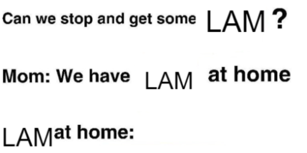

# 🐇 LAM At Home


#### *Work in progress - Only integration currently functioning is Telegram. Feel free to fork and PR if you make something cool :)*

## ❓ What does LAM At Home do?
This program locally runs playwright to constantly refresh hole.rabbit.tech, looking for new entries. If a new entry begins with a keyword, it will carry out an action.

**Example:**
Telegram *[Person] [Message]*

"Telegram Arthur: What's up?" 

This logs into Telegram, searches "@Arthur", clicks on topmost chat fitting the name, then sends a message with the remainder of the content from the prompt.

## 🌐 Current Integrations:
### Telegram:
**Syntax**: `"Telegram [User] [Message content]"` (Text mode)

**Setup**: If a Telegram prompt is detected, playwright will open up a telegram window, with a qr code. Head to the telegram app on your phone, tap the hamburger menu at top left, tap `Settings` > `Devices` > `Link Desktop Device` and scan the qr code. If you get an error like "Expired", manually refresh the telegram qr page. Your session will be saved so it will be rare that you need to do this.

**Tips**: There is a chance that you will be sending messages to random people. This is a result of the way telegram search works. The first word of your prompt needs to be "Telegram" for this to work.  If your r1 decides to save as a note, this will not work, try 5xptt and give your prompt again.

## 👨‍💻 Installation

```
git clone https://github.com/dot-Justin/LAMAtHome
pip install -r requirements.txt
playwright install
py main.py
```
## 🔥Acknowledgements

- Thanks to poke for the original idea [rabbitWrighter](https://github.com/glovergaytan-fs/rabbitWrighter/tree/main)
- Obligatory "There's no way you're that young" [rabbitt](https://github.com/GikitSRC/rabbitt)

## 📜 License

[MIT](https://choosealicense.com/licenses/mit/)

